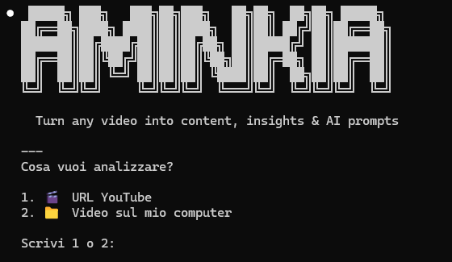
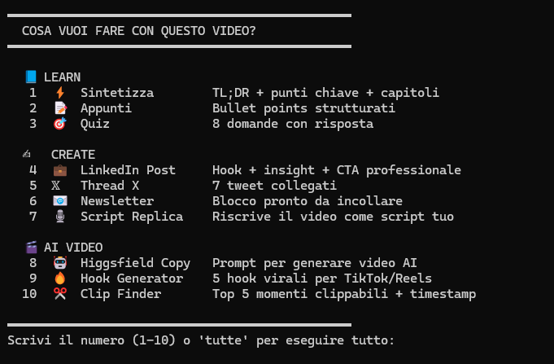
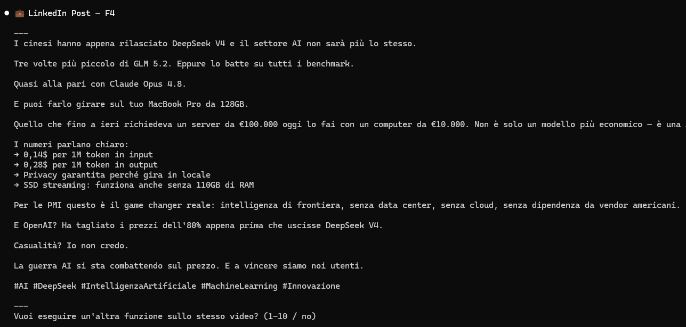
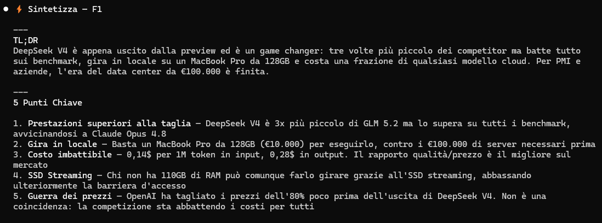

<div align="center">
  
  
  <h3>Turn any YouTube video into content, insights & AI prompts</h3>
  <p>Free · No API keys · No subscriptions · Works on Claude Code CLI and Claude.ai Web</p>

  
  
  
  
</div>

---

## What is Aminkia?

Aminkia takes any YouTube video and gives you **10 AI-powered tools** to learn faster, create content, and generate AI video prompts — using your existing Claude Pro subscription.

**No API keys. No extra costs. Works on Claude Code CLI and Claude.ai Web.**

---

## Who is it for?

| 👨‍🎓 Students | 🎬 Content Creators | 💼 Professionals | 🤖 AI Enthusiasts |
|---|---|---|---|
| Turn long lectures and tutorials into clean notes and quizzes in seconds | Generate LinkedIn posts, Twitter threads and hooks from any video | Extract key insights and newsletter content without watching the full video | Get optimized Higgsfield AI prompts and viral clip ideas from any content |

---

## How it works

**Step 1 — Launch and choose your source**



Type `/aminkia` in Claude Code. Choose between a YouTube URL or a video file on your computer. Aminkia installs any missing dependencies automatically.

---

**Step 2 — Pick one of 10 functions**



Once the transcript is loaded, choose what you need. Three categories: **Learn**, **Create**, **AI Video**.

---

**Step 3 — Get your output instantly**

*Example: LinkedIn Post (F4)*



*Example: Sintetizza — TL;DR + Key Points + Chapters (F1)*



---

## 10 Functions

### 📘 Learn
| # | Function | Output |
|---|---|---|
| 1 | ⚡ **Sintetizza** | TL;DR + 5 key points + chapter breakdown with timestamps |
| 2 | 📝 **Appunti** | Structured bullet-point notes, ready to study or share |
| 3 | 🎯 **Quiz** | 8 questions with answers to test your understanding |

### ✍️ Create
| # | Function | Output |
|---|---|---|
| 4 | 💼 **LinkedIn Post** | Professional post with hook, insights and CTA |
| 5 | 𝕏 **Thread X** | 7-tweet thread with hook and CTA |
| 6 | 📧 **Newsletter** | Ready-to-paste newsletter block |
| 7 | 🎙️ **Script Replica** | Rewrites the video as your own script to record |

### 🎬 AI Video
| # | Function | Output |
|---|---|---|
| 8 | 🤖 **Higgsfield Copy** | 4 optimized prompts for Higgsfield AI video generation |
| 9 | 🔥 **Hook Generator** | 5 viral hooks for TikTok and Reels |
| 10 | ✂️ **Clip Finder** | Top 5 clippable moments with timestamps and captions |

---

## Installation

### Option A — Claude Code CLI (recommended)
Automatic transcript download. Supports YouTube URLs and local video files.

```bash
curl -o ~/.claude/skills/aminkia.md https://raw.githubusercontent.com/Smhacker4/aminkia/main/aminkia.md
```

Open Claude Code and type:
```
/aminkia
```

**Requirements:**
- [Claude Code](https://claude.ai/code) with a Pro subscription
- Python 3 (pre-installed on most systems)
- `youtube-transcript-api` — installed automatically on first run
- For local video transcription: `openai-whisper` — installed automatically on request

---

### Option B — Claude.ai Web (zero setup)
Works directly in your browser. No installation needed — just copy and paste the transcript manually.

**Setup (one time, 2 minutes):**
1. Go to [claude.ai](https://claude.ai) → **Projects** → **New Project**
2. Name it `AMINKIA`
3. Click **"Set project instructions"**
4. Copy the content of [`aminkia-project.md`](aminkia-project.md) and paste it
5. Save

**How to get the YouTube transcript:**
1. Open any YouTube video
2. Click the **3 dots menu** (···) below the video
3. Select **"Show transcript"**
4. Select all → Copy → Paste into the chat

Then choose one of the 10 functions and you're done.

**Requirements:**
- Claude.ai account with a Pro subscription (free tier may have limits)

---

## FAQ

**Does it cost anything?**
No. Aminkia uses your existing Claude Pro subscription. No API keys, no extra charges.

**CLI or Web — which should I use?**
CLI if you want a fully automated experience (paste URL → get output). Web if you just want to try it instantly with zero setup.

**What videos work?**
Any public YouTube video with captions enabled (~80% of videos). CLI users: for the remaining 20%, use the local video option with Whisper transcription.

**What languages are supported?**
Italian and English by default. Output language matches the transcript language.

**Can I use it on my own videos?**
Yes — CLI version only. Choose option 2 at startup and provide the file path. Works with MP4, MOV, AVI and most common formats.

---

## License

MIT — free to use, fork, and build on.

---

<div align="center">
  <p>Built with Claude Code · Made in Switzerland 🇨🇭</p>
</div>
